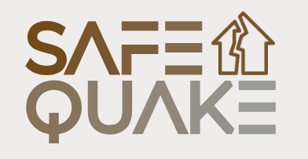

# Etapa 1: Propuesta del Proyecto
## Nombre del Proyecto: "SafeQuake"

  

## Por:
- Paul Antony Parizaca Mozo
- Avelino Lupo Condori
- Leon Felipe Davis Coropuna

## 1. Introducción

Los terremotos son desastres naturales que pueden poner en riesgo la vida de las personas si no se toman las medidas adecuadas. Para los estudiantes nativos digitales, habituados a entornos interactivos y tecnológicos, las formas tradicionales de aprender sobre seguridad sísmica pueden resultar aburridas y poco efectivas. Esta falta de interés se traduce en una menor retención de la información, lo que deja a muchos jóvenes poco preparados ante un evento sísmico.

En un contexto donde la tecnología ha transformado la manera en que aprendemos, es crucial adaptar los métodos educativos a las necesidades y expectativas de las nuevas generaciones. La realidad virtual (VR) se presenta como una herramienta poderosa para ofrecer simulaciones inmersivas y atractivas, que permiten a los estudiantes experimentar de manera realista lo que ocurre antes, durante y después de un terremoto. Este proyecto busca desarrollar un simulador en VR que combine actividades dinámicas y gamificación para no solo enseñar, sino también mantener el interés del usuario y reforzar su capacidad de respuesta en situaciones de emergencia.

## 2. Planteamiento del problema

Los estudiantes nativos digitales, acostumbrados a entornos interactivos y dinámicos, se enfrentan a un desafío cuando se les enseña sobre seguridad sísmica a través de métodos tradicionales. Estas formas de enseñanza no logran captar su atención ni motivarlos, lo que resulta en una baja retención de información y una preparación inadecuada para actuar ante un terremoto. El problema principal es cómo hacer que estos estudiantes se involucren activamente en el proceso de aprendizaje, adquiriendo y reteniendo habilidades esenciales para responder ante una emergencia.

## 3. Objetivos

### Objetivo General

Desarrollar una solución interactiva que eduque y conciencie a los estudiantes nativos digitales sobre las acciones a tomar antes, durante y después de un terremoto, utilizando principios de Interfaces Naturales. El proyecto empleará técnicas de gamificación para mejorar la retención de conocimientos y fomentar una respuesta efectiva ante situaciones de emergencia.

### Objetivos Específicos

- Crear una interfaz intuitiva y accesible que permita a los estudiantes interactuar de manera dinámica con escenarios simulados de terremotos.
- Implementar actividades de aprendizaje que motiven la participación activa, basadas en elementos de gamificación como recompensas y retroalimentación en tiempo real.
- Evaluar la usabilidad y efectividad de la interfaz a través de pruebas con usuarios, adaptando las funcionalidades según sus necesidades y comportamientos.
- Mejorar la capacidad de respuesta de los estudiantes mediante la práctica repetida de acciones clave en escenarios simulados.

## 4. Público Objetivo

El público objetivo principal de este proyecto son los estudiantes nativos digitales, jóvenes de entre 12 y 25 años, que han crecido en un entorno digital y están habituados a interactuar con tecnología avanzada, como videojuegos, aplicaciones y plataformas de aprendizaje en línea. Estos estudiantes se caracterizan por su capacidad para adaptarse rápidamente a nuevas herramientas tecnológicas, pero muestran una menor disposición hacia métodos de enseñanza tradicionales.

### Características:

- **Familiaridad tecnológica**: Estos estudiantes son usuarios frecuentes de dispositivos digitales y aplicaciones interactivas. Prefieren aprender a través de experiencias inmersivas y visuales que les permitan explorar y participar activamente en su proceso de aprendizaje.
- **Estilos de aprendizaje**: Se inclinan por métodos que sean más prácticos y dinámicos, prefiriendo tareas que incluyan interacción, retroalimentación inmediata y una narrativa que los motive a progresar.

### Motivaciones:

- **Engagement**: Necesitan sentirse motivados y comprometidos con el contenido que se les presenta. La gamificación y la simulación de escenarios reales resultan ser herramientas efectivas para mantener su atención y aumentar su participación.
- **Recompensas inmediatas**: Buscan reconocimiento y progreso medibles, como puntuaciones, niveles o logros, que les permitan visualizar su avance de manera tangible.

### Deficiencias:

- **Baja retención en métodos tradicionales**: Los métodos de enseñanza tradicionales no logran captar su atención ni motivarlos lo suficiente, lo que resulta en una baja retención de conocimientos esenciales sobre seguridad sísmica.
- **Falta de experiencia práctica**: Aunque comprenden conceptos teóricos, a menudo carecen de la experiencia práctica necesaria para saber cómo actuar correctamente en situaciones de emergencia como un terremoto.

### Necesidades:

- **Aprendizaje interactivo**: Requieren una solución que les permita practicar de manera interactiva y repetitiva los pasos correctos a seguir antes, durante y después de un terremoto.
- **Simulación de escenarios reales**: Es fundamental que puedan experimentar situaciones realistas, lo que les permitirá reforzar su conocimiento y mejorar su capacidad de respuesta en una emergencia.

## 5. Qué hará el proyecto

El proyecto desarrollará una solución educativa interactiva centrada en enseñar a los estudiantes las acciones esenciales que deben realizar antes, durante y después de un terremoto. A través de simulaciones realistas, los estudiantes podrán practicar decisiones clave en distintos escenarios, como preparar una mochila de emergencia, decidir dónde ubicarla dentro del hogar, identificar zonas seguras, y actuar según las indicaciones de las autoridades durante la emergencia.

Además, se cubrirán aspectos prácticos de la preparación, como el ensamblaje correcto de una mochila de emergencia con suministros necesarios, la organización de un plan de evacuación familiar, y la ubicación adecuada de objetos en el hogar para minimizar riesgos durante un sismo. Estas actividades no solo reforzarán el conocimiento teórico, sino que también permitirán a los estudiantes aplicar lo aprendido en situaciones simuladas.

Una de las características principales del proyecto será la **gamificación**, diseñada para mantener el interés y motivación de los estudiantes. Los usuarios podrán ganar puntos y recibir recompensas por realizar correctamente cada tarea, como identificar las zonas más seguras o completar la mochila de emergencia con los elementos adecuados. Las tablas de clasificación y logros personales fomentarán la participación activa y la repetición de las simulaciones para mejorar las habilidades.

La interfaz será intuitiva y visualmente atractiva, permitiendo que los estudiantes interactúen con los escenarios simulados en tiempo real. En cada simulación, los usuarios podrán tomar decisiones clave, como evacuar un edificio de manera segura, ubicar correctamente la mochila de emergencia o seguir instrucciones precisas para mitigar el daño después del terremoto. La retroalimentación inmediata después de cada simulación les permitirá aprender de sus errores y mejorar su respuesta en futuros intentos.

Además, los estudiantes podrán elegir distintos entornos para practicar, como una casa, una escuela o un espacio público, adaptando el contexto de las simulaciones a situaciones que sean relevantes para ellos. El sistema también permitirá repetir las simulaciones cuantas veces sea necesario, fortaleciendo su memoria procedimental y asegurando que estén preparados para actuar correctamente en una situación real.

## 6. Análisis de sistemas existentes

### Aplicaciones Competidoras:

#### Earthquake Simulator (Simulador de Terremotos)

- **Descripción**: Earthquake Simulator es una aplicación diseñada para enseñar a los usuarios sobre los efectos de los terremotos y cómo reaccionar ante ellos. Permite a los usuarios experimentar virtualmente diferentes escenarios sísmicos y ver cómo afectan a estructuras y personas.

- **Aspectos Positivos**:
  - Simulación Realista: Proporciona una experiencia inmersiva que permite a los usuarios visualizar cómo los terremotos afectan a diferentes tipos de estructuras y entornos.
  - Interactividad: Los usuarios pueden interactuar con el entorno, lo que mejora el compromiso y la comprensión de las dinámicas de un terremoto.
  - Educación: La aplicación incluye información educativa sobre la preparación y respuesta ante terremotos, lo que puede ser útil para aumentar la concienciación.

- **Aspectos Negativos**:
  - Enfoque Limitado en la Educación: Aunque simula efectos de terremotos, no ofrece una guía clara sobre qué hacer antes, durante y después de un sismo, lo que podría llevar a confusiones o falta de preparación.
  - Usabilidad: La interfaz puede resultar compleja para usuarios jóvenes o menos tecnológicos, lo que limita su accesibilidad y eficacia.
  - Falta de Gamificación: Carece de elementos gamificados que podrían mejorar la motivación y el compromiso del usuario, lo que podría resultar en una menor retención de información.

- **Soluciones Propuestas por el Proyecto**:
  - Guía Educativa Completa: A diferencia de Earthquake Simulator, el videojuego propuesto incluirá un enfoque estructurado sobre las acciones que deben tomarse antes, durante y después de un terremoto, asegurando que los usuarios tengan un conocimiento claro y aplicable.
  - Diseño Interactivo y Amigable: El videojuego se diseñará teniendo en cuenta la experiencia del usuario, con una interfaz intuitiva y atractiva para los jóvenes, asegurando que todos los usuarios, independientemente de su nivel de habilidad técnica, puedan participar y aprender.
  - Elementos de Gamificación: Incorporar un sistema de puntos, recompensas y niveles de dificultad aumentará la motivación y el compromiso, mejorando la retención de conocimientos y la capacidad de respuesta ante situaciones de emergencia.

#### Natural Disaster

- **Descripción**: Natural Disaster es un juego creado con el fin de simular desastres naturales y es compatible con VR. Comprende distintos desastres naturales y es posible jugarlo con amigos.

- **Aspectos Positivos**:
  - Aleatoriedad: No se puede saber qué desastre habrá, lo que lo hace divertido.
  - Interactividad: Hay muchos eventos en el juego, como piedras y objetos que provocan daño.
  - Usabilidad: Es sencillo saber qué hacer debido a la simpleza del juego.

- **Aspectos Negativos**:
  - Enfoque Limitado en la Educación: Aunque simula efectos de terremotos, no ofrece guías ni orientaciones, por lo que es puramente de entretenimiento.
  - Falta de Gamificación: Carece de elementos gamificados que podrían mejorar la motivación y el compromiso del usuario, lo que podría resultar en una menor retención de información.

- **Soluciones Propuestas por el Proyecto**:
  - Guía Educativa Completa: El videojuego propuesto incluirá un enfoque estructurado sobre las acciones que deben tomarse antes, durante y después de un terremoto, asegurando que los usuarios tengan un conocimiento claro y aplicable.
  - Diseño Interactivo y Amigable: El videojuego se diseñará teniendo en cuenta la experiencia del usuario, con una interfaz intuitiva y atractiva para los jóvenes, asegurando que todos los usuarios, independientemente de su nivel de habilidad técnica, puedan participar y aprender.
  - Elementos de Gamificación: Incorporar un sistema de puntos, recompensas y niveles de dificultad aumentará la motivación y el compromiso, mejorando la retención de conocimientos y la capacidad de respuesta ante situaciones de emergencia.

## 7. Artículos Relacionados

#### 1. "Natural User Interface - Next Mainstream Product User Interface"
- **Ventajas**:
  - Enfoque en la interacción natural: Las interfaces naturales, como el uso de gestos y voz, imitan interacciones humanas cotidianas, lo que facilita el uso sin necesidad de un entrenamiento especializado.
  - Multicanalidad: Las interfaces que utilizan múltiples canales sensoriales (vista, tacto, voz) permiten una interacción más eficiente y natural.
  - Alta personalización y adaptabilidad: Las interfaces naturales pueden ajustarse a las necesidades y habilidades individuales de los usuarios, lo que mejora la accesibilidad.
- **Desventajas**:
  - Limitaciones tecnológicas: El reconocimiento de voz y gestos aún no es perfecto en entornos ruidosos o con variaciones culturales.
  - Costos de desarrollo e implementación: Crear interfaces naturales que utilicen múltiples canales sensoriales puede ser costoso.
  - Riesgo de sobrecarga cognitiva: El uso excesivo de modalidades sensoriales simultáneamente puede distraer a los usuarios.

#### 2. "A Natural User Interface implementation for an Interactive Learning Environment"
- **Ventajas**:
  - Motivación y disfrute: El uso de interfaces naturales, como el reconocimiento de gestos, aumenta la motivación y el disfrute.
  - Facilidad de uso: La interacción mediante gestos mejora la percepción de facilidad de uso.
  - Participación activa: Los estudiantes trabajan colaborativamente, lo que fomenta la interacción entre pares.
- **Desventajas**:
  - Limitación en el contenido educativo: El contenido educativo debe ser variado y significativo para mantener el interés de los estudiantes.
  - Necesidad de práctica previa: Las interfaces naturales requieren tiempo inicial de práctica.
  - Efecto de novedad: El entusiasmo inicial puede disminuir si no se actualiza el contenido regularmente.

#### 3. "Exploring the effects of a serious game-based learning package for disaster prevention education: The case of Battle of Flooding Protection"
- **Ventajas**:
  - Interactividad: El enfoque basado en juegos promueve una experiencia de aprendizaje atractiva.
  - Aumento del interés: Se demostró que el juego incrementa el interés de los estudiantes en la educación sobre desastres.
  - Desarrollo de habilidades: Los estudiantes adquieren habilidades prácticas y mejoran su comprensión.
- **Desventajas**:
  - Dependencia de la tecnología: Requiere recursos tecnológicos que pueden no estar disponibles en todos los entornos educativos.
  - Limitaciones en el alcance: El enfoque en inundaciones limita su aplicabilidad a otros desastres.

#### 4. "Revolutionizing elementary disaster prevention education and training via augmented reality-enhanced collaborative learning"
- **Ventajas**:
  - Interactividad aumentada: La realidad aumentada mejora la comprensión del material de aprendizaje.
  - Colaboración mejorada: Fomenta el aprendizaje en grupo y facilita habilidades sociales.
  - Flexibilidad: Permite el aprendizaje fuera del aula.
- **Desventajas**:
  - Dependencia tecnológica: Requiere dispositivos y recursos tecnológicos.
  - Desafíos de implementación: Integrar la tecnología en el currículo puede ser complejo.

## 7. Referencias bibliográficas

- Barron Estrada, Maria, Zatarain Cabada, Ramón, & Cardenas-Sainz, Brandon. (2020). A Natural User Interface implementation for an Interactive Learning Environment. *341-343*. https://doi.org/10.1109/ICALT49669.2020.00109.

- Weiyuan Liu. "Natural user interface - next mainstream product user interface," *2010 IEEE 11th International Conference on Computer-Aided Industrial Design & Conceptual Design 1*, Yiwu, China, 2010, pp. 203-205. https://doi.org/10.1109/CAIDCD.2010.5681374.

- Meng-Han Tsai, Yu-Lien Chang, Jen-Shiuan Shiau, & Shun-Mei Wang. (2020). Exploring the effects of a serious game-based learning package for disaster prevention education: The case of Battle of Flooding Protection. *International Journal of Disaster Risk Reduction*, Volume 43, 101393. ISSN: 2212-4209. https://doi.org/10.1016/j.ijdrr.2019.101393.

- Su-Ju Lu, Yu-Chiao Lin, Kim Hua Tan, & Ying-Chieh Liu. (2022). Revolutionizing elementary disaster prevention education and training via augmented reality-enhanced collaborative learning. *International Journal of Engineering Business Management*, 14, 18479790211067345. https://doi.org/10.1177/18479790211067345.
